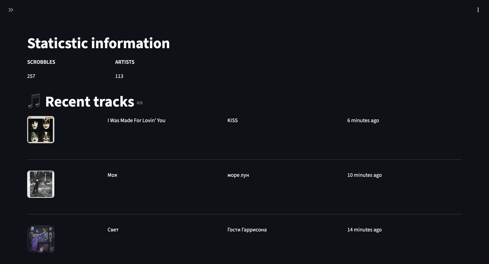
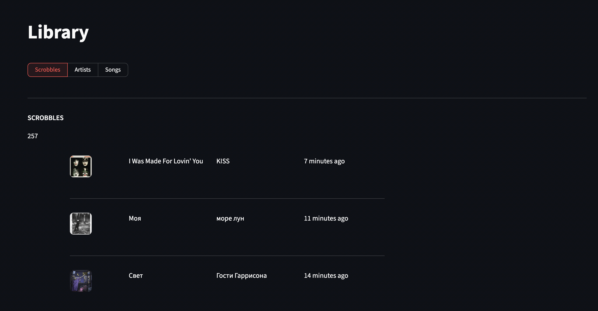
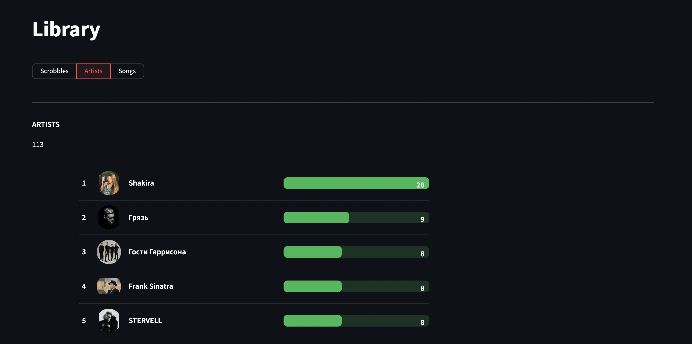
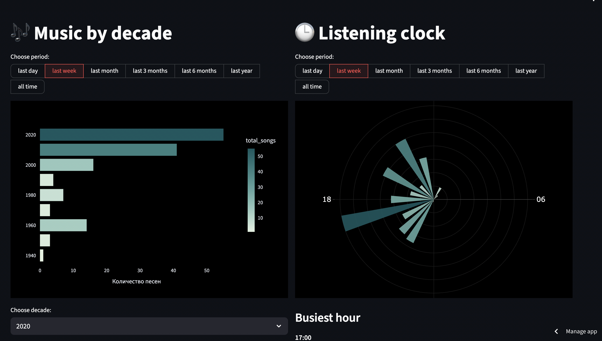
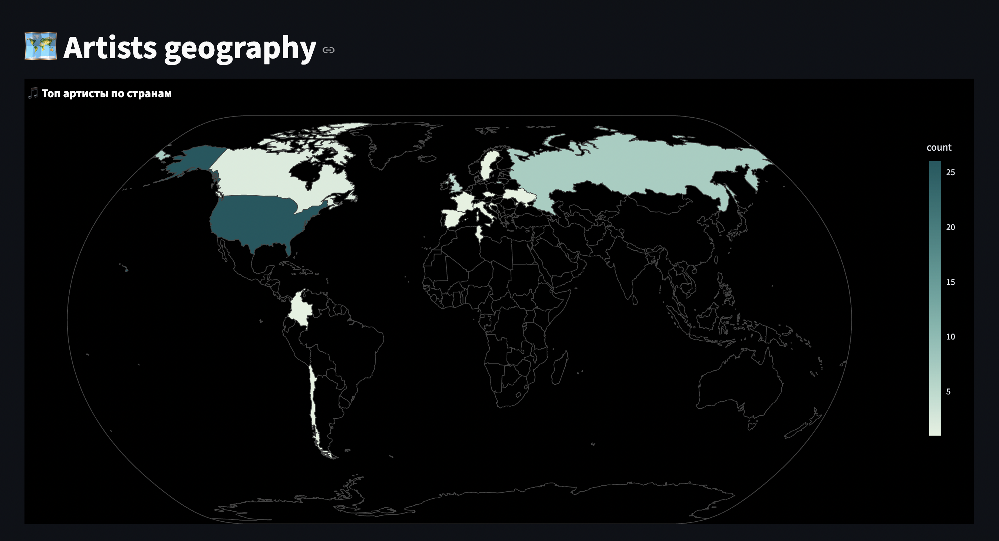

# nap-fm — сервис персональной аналитики прослушиваний

**nap-fm** — это персональный дашборд для анализа истории прослушиваний музыки.  
Проект собирает данные из Spotify, сохраняет их в базу данных и визуализирует статистику через веб-интерфейс (на Streamlit).

Посмотреть на работу сервиса можно по [ссылке](https://nap-fm-h9hgx5da7tu2qdbteig9h2.streamlit.app/)
---

## Возможности

- История прослушивания 
- Информация и статистика по артистам и песням
- Топы песен и артистов
- Географическое распределение песен и артистов 
- Распределение прослушиваний по часам дня
- Автоматическое обновление данных

---

## Статус проекта

Проект находится в активной разработке.  
На данный момент реализован **полноценный MVP**:

- Интерактивный интерфейс Streamlit  
- Рабочая база данных со схемой и отношениями 
- Встроенный сборщик данных 
- Аналитические страницы 
- Визуализация

### Планируется:

- Добавление возможности выбора периода для которого будет строиться аналитика(в настоящий момент такое есть, но не везде)  
- Добавление новой страницы и различной аналитики посвященной жанрам  
- Больше информации о песнях/артистах
- Новые графики и таблицы
- Многопользовательская поддержка  

---

## Технологии

**Back-end / Data:**
- Python 3.9 
- SQLAlchemy  
- PostgreSQL (Neon)  

**Front-end:**
- Streamlit  
- Plotly  

**Сбор данных:**
- Spotify Web API (Spotipy)  
- GitHub Actions  

**Инфраструктура:**
- DBeaver (администрирование базы)  
- Streamlit Cloud 

---

## Скриншоты

- ### Overview:

--

- ### Library:

--

- ### Reports

--

