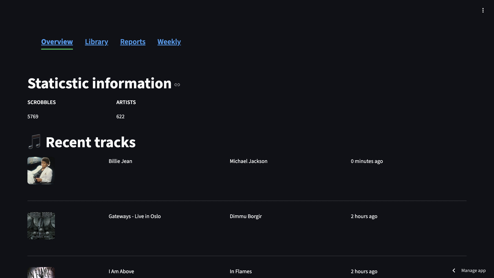
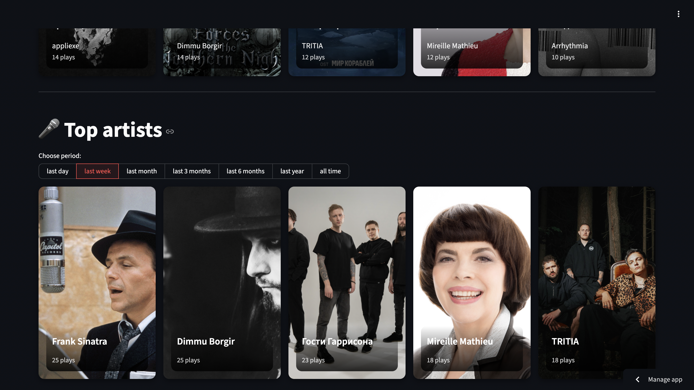
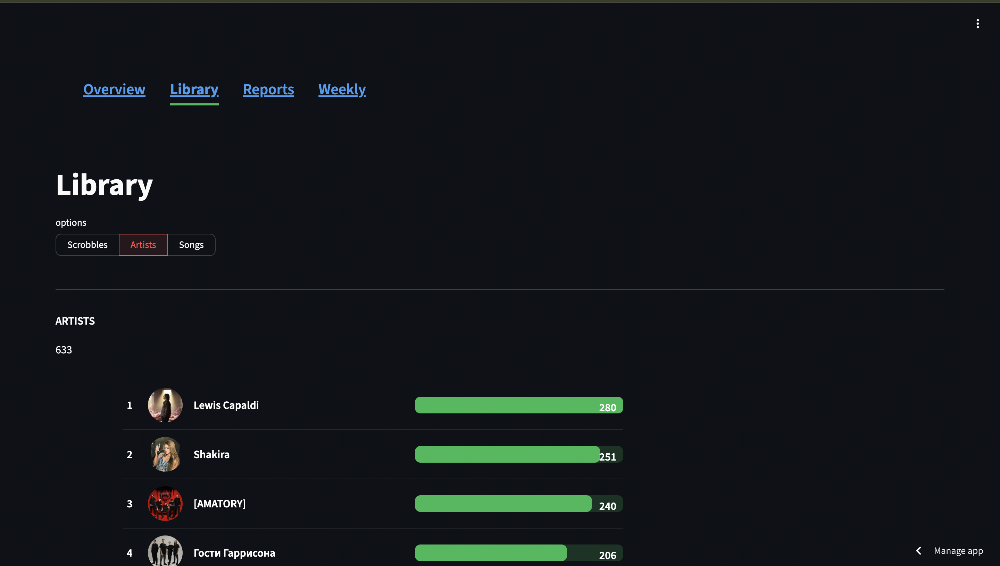
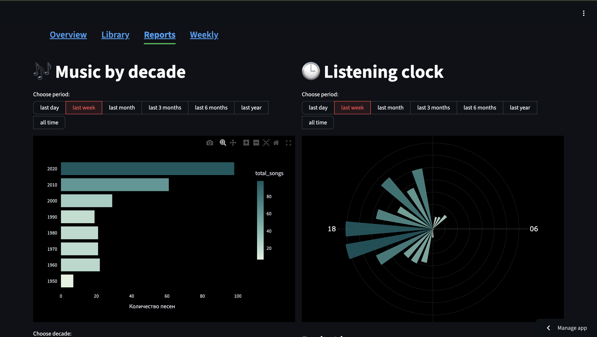
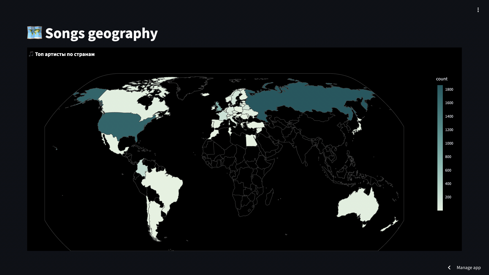
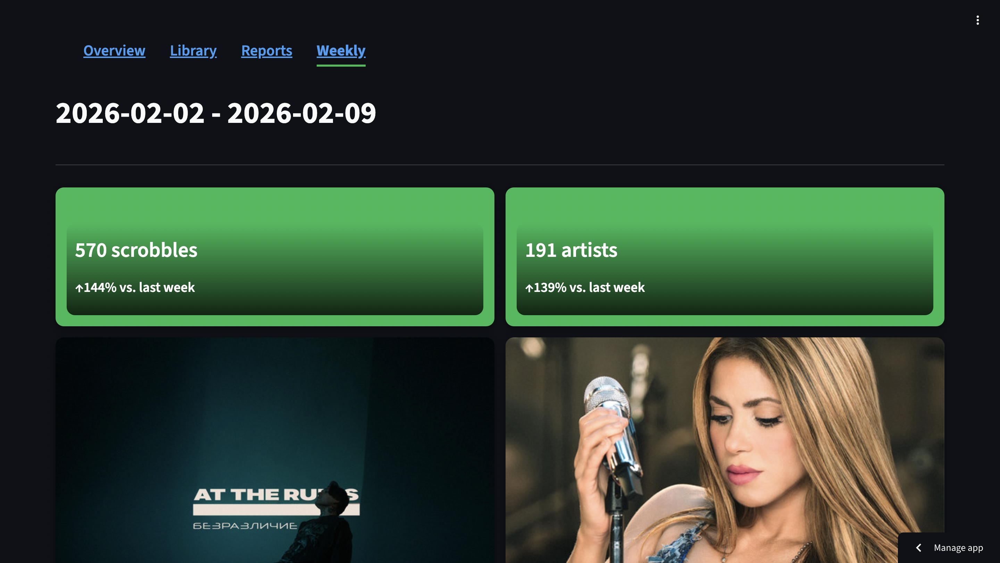
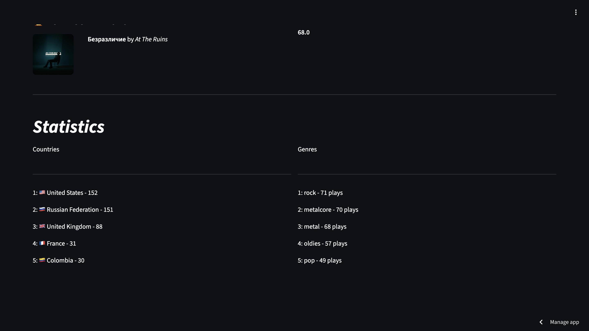

🇬🇧 English | [🇷🇺 Русский](README.ru.md)

# nap-fm — personal audio analytics service

**nap-fm** is a personal dashboard for analyzing music listening history.  
The project collects data from Spotify, stores it in a database, and visualizes statistics through a web interface (built with Streamlit).

You can explore the live service via this [link](https://nap-fm.streamlit.app/) (temporarily out of service)
---

## Features

- Listening history  
- Information and statistics about artists and tracks  
- Top tracks and artists  
- Geographic distribution of tracks and artists  
- Distribution of listening activity by hour of the day  
- Automatic data updates  

---

## Project Status

The project is under active development.  
At the moment, a **fully functional MVP** has been implemented:

- Interactive Streamlit interface  
- Working database with schema and relationships  
- Built-in data collection pipeline  
- Analytical pages  
- Data visualizations  

### Planned:

- Adding the ability to select a time period for analytics (currently available, but not everywhere)  
- More detailed information about tracks/artists  
- New charts and tables  
- Multi-user support  

---

## Technologies

**Back-end / Data:**
- Python 3.9  
- SQLAlchemy  
- PostgreSQL (Neon)  

**Front-end:**
- Streamlit  
- Plotly  

**Data Collection:**
- Spotify Web API (Spotipy)  
- GitHub Actions  

**Infrastructure:**
- DBeaver (database administration)  
- Streamlit Cloud  

---

## Screenshots

- ### Overview:

--

- ### Library:

- ### Reports

--

- ### Weekly

--

